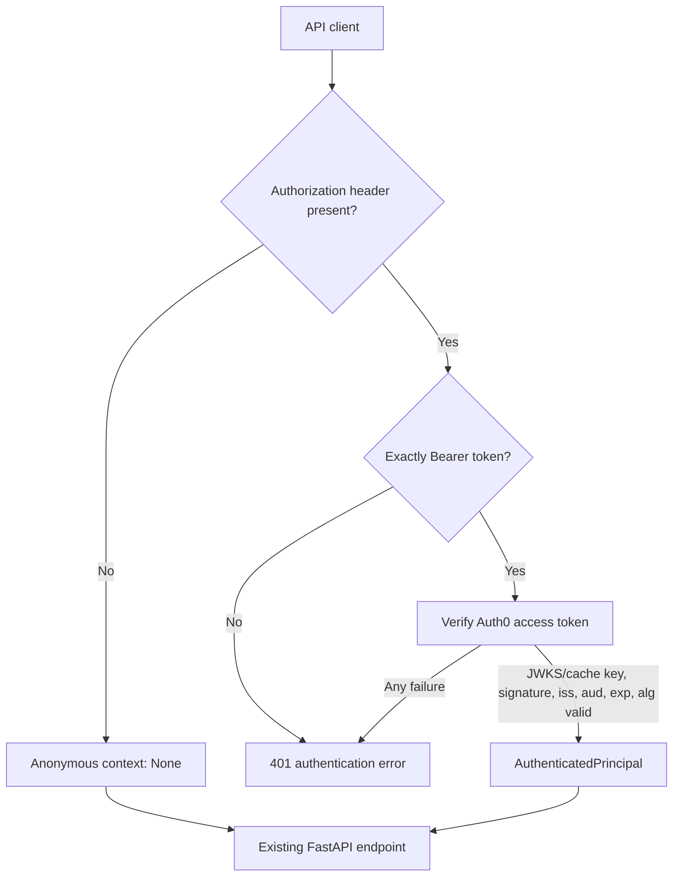

# Optional Auth0 Authentication Implementation Plan

## Executive Summary

`compose-api` is a FastAPI service whose active endpoints are currently public. The application has no server-side
JWT, OAuth, OIDC, or Auth0 verification code. The generated HTTP client already has a generic
`compose_api.api.client.client.AuthenticatedClient`, but that only adds an `Authorization` header and does not
authenticate requests at the API.

The safest first implementation is an optional authentication dependency shared by the active routers. It should
return `None` for a request with no `Authorization` header, return a typed principal after fully validating an Auth0
access token, and raise HTTP 401 when a client supplies malformed or invalid credentials. No endpoint should become
mandatory-authenticated as part of this work. Authorization rules, local user persistence, and account provisioning
remain separate future decisions.

The known Auth0 tenant is `dev-bu7yo7484tyxu6a1.us.auth0.com`, with issuer
`https://dev-bu7yo7484tyxu6a1.us.auth0.com/`. The Auth0 API Identifier/audience has not been supplied and must be
chosen in the Auth0 Dashboard before implementation is completed.

## Goals

- Preserve anonymous access to every currently active endpoint.
- Accept Auth0 access tokens issued for the compose-api API.
- Verify the JWT signature, issuer, audience, expiration, algorithm, and required structural claims.
- Handle Auth0 JWKS caching and signing-key rotation without fetching keys on every request.
- Make a validated identity available through a small typed application principal.
- Keep authentication separate from future authorization and permissions.
- Represent optional bearer authentication clearly in generated OpenAPI/Swagger documentation.
- Add deterministic tests that do not depend on the development tenant or live Auth0 availability.
- Flow non-secret Auth0 configuration through the existing Pydantic settings and deployment environment patterns.

## Non-Goals

- Requiring login, signup, or an Auth0 account for existing API consumers.
- Implementing role- or scope-based authorization for current routes.
- Creating or synchronizing a local users table.
- Using Auth0 Management API credentials.
- Accepting ID tokens as API credentials.
- Adding an Auth0 login UI or callback route to this backend.
- Changing simulation ownership, result visibility, rate limits, quotas, or other product policy.
- Replacing the generated client or hand-editing generated files.

## Authentication Behavior

The implementation must preserve this three-way distinction:

| Request | Result |
|---|---|
| No `Authorization` header | Anonymous request continues normally; no 401 |
| `Authorization: Bearer <valid access token>` | Token is verified and an authenticated principal is available |
| Any supplied malformed, expired, wrongly signed, wrongly issued, wrongly targeted, or unsupported token | 401; never downgrade to anonymous |

The dependency must treat only a genuinely absent header as anonymous. A malformed scheme, an empty bearer token,
an extra token component, an unsupported algorithm, or any verification failure is an authentication failure. The
server should return the repository's normal FastAPI JSON error shape with a generic authentication detail and a
`WWW-Authenticate: Bearer` header where appropriate; it must not reveal token or key material.

## Repository Audit Findings

### Application Architecture

- `compose_api/api/main.py` creates the module-level `FastAPI` instance as `app = FastAPI(...)`.
- The lifespan function `lifespan()` calls `init_standalone()`, starts the `JobMonitor`, optionally subscribes to NATS,
  starts polling, and closes services on shutdown.
- The service is an HPC-only simulation API. Routers delegate to handlers, handlers use service singletons and
  database facades, and `SimulationServiceHpc` submits Singularity/Apptainer jobs through SSH and SLURM.
- `compose_api/dependencies.py` owns module-level service singletons and provides `get_*` and `get_required_*`
  accessors. This is the established dependency-injection pattern, but authentication should not become another
  mutable global singleton.

### FastAPI Entry Point

`compose_api/api/main.py` dynamically imports the names in `APP_ROUTERS = ["curated", "simulation", "results", "compute"]`
and includes each module's `config.router` with its `config.prefix`. Router import failures are logged and swallowed.
The same file registers CORS middleware and the `/health` and `/version` endpoints. The lifespan is the appropriate
place for application resources that need closing, but a JWKS cache can remain a process-local, lazily initialized
component unless the selected library requires explicit lifecycle management.

### Routers and Endpoints

The active routes discovered in `compose_api/api/routers/` and `compose_api/api/main.py` are:

| Router / endpoint | Current behavior | First Auth0 phase |
|---|---|---|
| `GET /health` (`main.py::check_health`) | Public health/version metadata | Anonymous allowed; optional identity may be parsed but is not required |
| `GET /version` (`main.py::get_version`) | Public version string | Anonymous allowed |
| `POST /simulation/run` (`routers/simulation.py::submit_simulation`) | Public simulation submission | Anonymous allowed; optional identity context |
| `GET /results/simulations/status/batch` (`routers/results.py::get_simulations_status_batch`) | Public status lookup | Anonymous allowed; optional identity context |
| `GET /results/simulation/status` (`routers/results.py::get_simulation_status`) | Public status lookup | Anonymous allowed; optional identity context |
| `GET /results/simulation/results/file` (`routers/results.py::get_results`) | Public result download | Anonymous allowed; optional identity context |
| `GET /results/simulator/build/status` (`routers/results.py::get_simulator_build_status`) | Public build-status lookup | Anonymous allowed; optional identity context |
| `GET /core/simulator/list` (`routers/compute.py::get_simulator_list`) | Public catalog lookup | Anonymous allowed; optional identity context |
| `GET /core/processes/list` (`routers/compute.py::get_processes_list`) | Public catalog lookup | Anonymous allowed; optional identity context |
| `GET /core/steps/list` (`routers/compute.py::get_steps_list`) | Public catalog lookup | Anonymous allowed; optional identity context |
| `POST /curated/copasi` (`routers/curated.py::run_copasi`) | Public curated submission | Anonymous allowed; optional identity context |
| `POST /curated/tellurium` (`routers/curated.py::run_tellurium`) | Public curated submission | Anonymous allowed; optional identity context |

There are no active WebSocket routes, administrative routes, or deliberately protected routes. Several commented-out
routes are not part of the policy matrix and should not be activated or assigned authentication policy by this plan.

Each router exposes a module-level `config = RouterConfig(router=APIRouter(), prefix=..., dependencies=[])`.
Existing routes already use `Depends(...)` for service readiness checks, but no shared user dependency exists.

### Dependency Injection

The idiomatic insertion point is a new authentication dependency module, proposed as
`compose_api/authentication.py` (NEW FILE), exposing a function such as
`get_optional_authenticated_principal(...) -> AuthenticatedPrincipal | None`.
It should use FastAPI's optional bearer credential extraction (`HTTPBearer(auto_error=False)`) only to distinguish an
absent header, then explicitly reject malformed supplied credentials and call the verifier.

Because route-level `dependencies=[Depends(...)]` executes a dependency but does not pass its return value into a
handler, use one of these two coordinated mechanisms:

1. Add the dependency as a typed parameter to handlers that need the identity, while keeping all current handlers
   unchanged initially; or
2. Add a request-context dependency that stores the already validated principal in `request.state`, and expose a
   typed `get_request_principal` dependency for handlers/services that need it later.

The implementation should prefer the first approach for actual identity consumers and avoid an untyped request-state
global unless a cross-cutting audit requirement is demonstrated. If all routes must validate optional credentials
without changing signatures, a small request-state adapter can be added deliberately and tested. In either design,
the verifier itself remains centralized and invalid credentials propagate as 401.

### Configuration

`compose_api/config.py` contains the single Pydantic Settings model. It loads the git-ignored
`assets/dev/config/.dev_env`, then optional files named by `CONFIG_ENV_FILE` and `SECRET_ENV_FILE`, and caches the
base settings via `_load_settings()`. Tests use `override_settings(**fields)` for isolated partial overrides.

Add only settings justified by token verification:

```text
AUTH0_DOMAIN=dev-bu7yo7484tyxu6a1.us.auth0.com
AUTH0_AUDIENCE=<AUTH0 API Identifier; required decision>
AUTH0_ISSUER=<optional derived value, preferably derived from AUTH0_DOMAIN>
AUTH0_ALGORITHMS=RS256
```

Prefer deriving the issuer as `https://{auth0_domain}/` and constraining the algorithm in code to a typed, explicit
allow-list. A separate issuer setting is only justified if deployments genuinely use different issuers; otherwise it
creates a second source of truth. `AUTH0_AUDIENCE` must not receive a made-up default, because audience validation
cannot be safe without the actual API Identifier. If settings validation requires it at process startup, document the
deployment migration clearly; alternatively, fail when an explicitly supplied token is verified while allowing fully
anonymous operation only if that behavior is an intentional rollout choice. This decision belongs in implementation
review.

### Existing Security/Authentication

There is no server-side implementation matching `auth`, `authentication`, `authorization`, JWT, bearer, OAuth, OIDC,
JWKS, `HTTPBearer`, or `OAuth2`. `ServiceType.AUTH` and `LoginForm` in `compose_api/common/gateway/models.py` are
unused generic/domain declarations, not an authentication system. `CORSMiddleware` in `api/main.py` is unrelated to
identity and must not be treated as an auth boundary.

The generated client contains `AuthenticatedClient` with configurable `token`, `prefix`, and
`auth_header_name`. It is generated client behavior only; it does not validate server credentials and should remain
unchanged unless regeneration changes it as a consequence of an OpenAPI security scheme.

### Models

The domain models are Pydantic models in `compose_api/simulation/models.py`; there is no user model or identity table.
The initial implementation should not add Auth0 users to PostgreSQL. A principal should be an application-level
immutable model containing only claims with a concrete use, at minimum:

- `subject` from verified `sub`;
- `issuer` and normalized audience for diagnostics or future policy;
- normalized scopes and permissions, if present, for future authorization;
- a minimal immutable claims mapping only if downstream code demonstrably needs additional validated claims.

Do not pass an unverified or raw decoded JWT through the application. Do not include access tokens, refresh tokens, or
unnecessary profile/PII claims in the principal.

### Error Handling

The application currently raises `fastapi.HTTPException` directly in routers and handlers; no application-wide
exception handlers were found. The auth dependency should raise `HTTPException(status_code=401, headers={"WWW-Authenticate":
"Bearer"}, detail="Invalid authentication credentials")` or an equivalent centralized auth exception mapped once at
the dependency boundary. Avoid returning 500 for token errors and avoid exposing library exception text.

### OpenAPI

`FastAPI(...)` is created directly in `api/main.py` and the generated OpenAPI artifact is produced by
`compose_api/api/openapi_spec.py`. There is no existing security scheme or OpenAPI customization.

FastAPI's `HTTPBearer(auto_error=False)` is useful for extraction but does not by itself express the full optional
semantics in every generated OpenAPI consumer. The implementation should define a bearer security scheme for Swagger's
Authorize button and ensure each public endpoint's operation uses an optional security requirement equivalent to:

```json
"security": [{}, {"BearerAuth": []}]
```

An empty security requirement means anonymous access is valid; the bearer alternative documents that a token may be
provided. Confirm the exact FastAPI-generated schema and, if needed, implement a narrow `app.openapi` customization in
`api/main.py` rather than marking routes mandatory. Regenerate the checked-in spec and client only after the schema is
verified.

### Tests

Tests use pytest/pytest-asyncio, in-process `httpx.ASGITransport`, and the `http_api_client` fixture from
`tests/fixtures/api_fixtures.py`. Fixtures are re-exported through `tests/conftest.py`. Existing integration fixtures
use Docker-backed Postgres, NATS, MongoDB, and SLURM; auth unit tests should not add a live Auth0 dependency.

Add deterministic tests for the verifier and API dependency using generated RSA keys and a mocked JWKS transport/cache.
Use `http_api_client` for status/header assertions and the generated client only where the OpenAPI response contract is
the subject. Existing route tests should explicitly retain anonymous requests.

### Deployment

`Dockerfile-api` installs the locked `uv` environment and runs Uvicorn on port 8000. The Kubernetes deployment in
`kustomize/base/api.yaml` imports a ConfigMap with `envFrom` and individual Secret values. The active API ConfigMap
content is in `kustomize/config/compose-api-rke/api.env` and the local counterpart is
`kustomize/config/compose-api-local/api.env`; the latter currently contains only `INTERNAL_MOUNT_DIR`, while some
configuration is supplied through shared environment files.

Auth0 domain and audience are non-secret configuration and belong in the relevant ConfigMaps or deployment environment.
No Auth0 client secret is needed to validate an incoming access token. If future application-specific secrets are
introduced, they belong in a Kubernetes Secret and not in a ConfigMap or repository file.

### Relevant Dependencies

The project uses `uv`, `pyproject.toml`, and `uv.lock`; Python is `>=3.13.2,<4.0`, FastAPI is constrained to
`>=0.141.1,<0.142`, Pydantic is `>=2.11.5,<3`, and `httpx` is already a runtime dependency. No JWT/JWK/Auth0
verification package is currently declared.

The implementation should evaluate the current Auth0-supported Python package before coding. The conservative
repository fit is `PyJWT[crypto]` (PyJWT plus `cryptography`) with the existing `httpx` for a small, explicit JWKS
cache: it is a mature JWT verifier, supports issuer/audience/algorithm checks, and avoids custom cryptography. A
maintained Auth0 package may be preferable if its current API, FastAPI support, async behavior, and exception model
are verified against official documentation before dependency selection. Do not add both stacks. Do not use a library
that only decodes claims without signature verification.

## Current Request Flow

```text
FastAPI app (api/main.py)
  -> dynamically included router
  -> route-level service Depends(...)
  -> router handler
  -> simulation handler / database / HPC services
  -> SSHService -> SlurmService -> remote Apptainer job
  -> JobMonitor polling/NATS updates HpcRun
  -> DataService returns results.zip
```

Authentication should be inserted immediately after FastAPI has extracted request headers and before the route handler
uses any identity. It must not be embedded in the HPC, database, or simulation service layers. Those layers should
receive a typed principal only if a future feature actually needs user-aware behavior.

## Proposed Authentication Architecture

Add a small authentication boundary:

1. `Auth0Settings` values come from the existing `Settings`.
2. A process-local verifier owns the Auth0 issuer, expected audience, allowed algorithms, JWKS URL
   `https://{AUTH0_DOMAIN}/.well-known/jwks.json`, and cache policy.
3. An optional FastAPI dependency extracts the `Authorization` header.
4. No header returns `None` (or an explicit `AnonymousPrincipal` if a discriminated model proves useful).
5. A supplied bearer token is fully verified before any claims are used.
6. A validated token becomes an immutable `AuthenticatedPrincipal`.
7. Invalid supplied credentials raise 401 and never become `None`.

Do not add global mandatory middleware or a global `HTTPBearer` dependency. A dependency is easier to test with
FastAPI overrides, preserves route-level future policy, and keeps authentication independent from the existing
module-level HPC service wiring.

## Anonymous vs. Authenticated Request Flow



The endpoint continues to execute for both anonymous and valid-authenticated requests. The first release must not
change the business result solely because a principal is present.

## Authenticated Principal Design

Proposed new typed model, likely in `compose_api/authentication.py` or a small
`compose_api/authentication_models.py` if the verifier and models become too large:

```python
@dataclass(frozen=True, slots=True)
class AuthenticatedPrincipal:
    subject: str
    issuer: str
    audience: tuple[str, ...]
    scopes: frozenset[str]
    permissions: frozenset[str]
```

The verifier should normalize an audience string/list and split the OAuth `scope` string. `permissions` should be
populated only from a validated `permissions` claim and should not grant anything until authorization code explicitly
checks it. Omit empty claims rather than inventing application roles. A route can accept
`AuthenticatedPrincipal | None`; `None` is the anonymous representation. A future authorization dependency can then
require a principal or scope without changing JWT validation.

Do not persist this principal in the current database. Simulation records currently have no ownership policy, and
adding one would change data semantics beyond authentication.

## Auth0 Access Token Validation

Use an established JWT/JWK implementation rather than writing cryptographic verification. The verifier lifecycle
should be:

1. Read the raw `Authorization` header without logging it.
2. Require the `Bearer` scheme (case-insensitive scheme handling is acceptable); reject extra/missing token parts.
3. Read the JWT header only to select the cached JWKS key by `kid`; do not trust claims or use an unverified subject.
4. Resolve the key from the Auth0 JWKS endpoint, using a process-local cache.
5. Verify the signature with an explicitly configured asymmetric algorithm, expected initially `RS256`.
6. Require and validate `sub`, `iss`, `aud`, and `exp` as appropriate for the chosen library. Apply normal `nbf`/`iat`
   checks if the library supports them without introducing clock-skew surprises.
7. Require exact issuer `https://dev-bu7yo7484tyxu6a1.us.auth0.com/` derived from the configured domain.
8. Require the configured Auth0 API Identifier in `aud`; support an audience array according to JWT semantics.
9. Construct the principal only from the verified claims.

Do not accept HS256 or dynamically honor the token's `alg` header. Do not use an ID token, Management API token, or
opaque/unverified decoded payload as an API credential.

## JWKS and Signing-Key Strategy

The verifier must not fetch JWKS for every request. Use a bounded process-local cache with:

- a positive JWKS document TTL (for example, the selected library's default or a documented short interval);
- key lookup by `kid`;
- refresh on an unknown `kid` to support Auth0 signing-key rotation;
- a bounded timeout for the JWKS request;
- no indefinite retry loop inside a request;
- no acceptance of a token merely because the JWKS endpoint is unavailable.

If a key is unknown, refresh once, then reject with 401 if still unknown. If the JWKS endpoint is unavailable and no
valid cached key exists, fail closed with a generic authentication error. If a cached key can safely verify a token,
the implementation may use it during a transient refresh failure, subject to the selected library's cache semantics
and key TTL. Tests must pin whichever policy is chosen. Multi-worker deployments have one cache per worker, which is
acceptable and still avoids per-request fetching.

The cache implementation should be injectable or transport-mockable so tests can simulate rotation and outages.

## Authentication Error Handling

All token-validation failures should be mapped to the same safe 401 response class unless the project later requires
more granular diagnostics. Internally classify failures for logs/metrics without returning sensitive library details:

| Failure | External behavior |
|---|---|
| Missing header | Continue anonymously |
| Unsupported scheme, duplicate parts, empty token | 401 with Bearer challenge |
| Malformed JWT/header | 401 |
| Unsupported algorithm | 401 |
| Missing `kid` or unknown `kid` after one JWKS refresh | 401 |
| Invalid signature | 401 |
| Wrong issuer | 401 |
| Wrong audience | 401 |
| Expired or otherwise invalid temporal claims | 401 |
| Missing required `sub`/claims | 401 |
| JWKS timeout/network/parse failure | 401; log a bounded failure category |

Never catch all exceptions around the route and turn them into anonymous access. Only the explicit no-header path is
anonymous. Avoid logging the raw header, JWT, claims dump, or JWKS response.

## Auth0 Tenant Configuration

These are Auth0 Dashboard changes, separate from application changes:

1. In the `dev-bu7yo7484tyxu6a1.us.auth0.com` tenant, create or identify an API for compose-api under
   **Applications -> APIs**.
2. Choose a stable API Name and a unique API Identifier. The Identifier becomes `AUTH0_AUDIENCE`; it is currently
   unknown and must be supplied before implementation. Do not use a placeholder in a running deployment.
3. Set the API signing algorithm to `RS256`. The plan assumes Auth0's standard tenant JWKS endpoint.
4. Configure an Auth0 application/client able to obtain a development access token for this API. Use the minimum
   appropriate flow for the client type; do not add a client secret to compose-api merely to validate tokens.
5. Configure scopes/permissions only when a concrete authorization feature exists. The first release needs no
   application permissions.
6. Keep development and production APIs/identifiers separate if the environments have separate tenants or policies.
   Do not reuse a development audience for production accidentally.
7. Use the Dashboard API Test tab or an approved OAuth client to obtain a real development access token for manual
   testing. Never commit it.

Auth0's current Python documentation should be checked during implementation for its supported backend package and
verification API. The server only needs to validate access tokens; it does not need an Auth0 Management API client
secret.

## Application Configuration

Modify `compose_api/config.py` to add typed Auth0 settings following the existing uppercase-environment-to-lowercase
Pydantic Settings convention. Proposed names are `auth0_domain` and `auth0_audience`, with an explicit algorithm
setting only if multiple algorithms are intentionally supported. Derive `auth0_issuer` from the domain to avoid
issuer/audience drift.

Document the non-secret variables in the existing environment template
`assets/dev/config/.dev_env_TEMPLATE` (existing file) as placeholders, for example:

```text
AUTH0_DOMAIN=dev-bu7yo7484tyxu6a1.us.auth0.com
AUTH0_AUDIENCE=<set to the Auth0 API Identifier>
```

Do not put a real audience, client secret, token, or private key in the repository. Update deployment ConfigMaps
only in the implementation task after the API Identifier is decided; this planning task intentionally makes no
deployment changes.

## Dependency Changes

Modify `pyproject.toml` and `uv.lock` only in the implementation task after selecting and verifying the package.
The likely minimal choice is `PyJWT[crypto]`; `httpx` is already present for transport. `cryptography` is needed for
RS256 key verification. If an officially maintained Auth0 package is selected instead, confirm it supports Python
3.13/3.14, the current FastAPI/Pydantic stack, async or non-blocking JWKS retrieval, and testable error handling
before replacing this recommendation. Do not add redundant JWT libraries.

## OpenAPI / Swagger Integration

Add a bearer security scheme named consistently (for example `BearerAuth`) and ensure Swagger UI exposes its
Authorize control. The schema must still say that current endpoints permit anonymous requests. The recommended
operation security representation is:

```json
[
  {},
  { "BearerAuth": [] }
]
```

Validate the generated schema in a test and regenerate `compose_api/api/spec/openapi_3_1_0_generated.yaml` and the
client only after reviewing the resulting diff. If the generated client begins exposing auth parameters, preserve
the existing unauthenticated `Client` and optional use of `AuthenticatedClient`. Never hand-edit files under
`compose_api/api/client/`.

## Endpoint Authentication Matrix

All active endpoints remain optional-authentication endpoints in the initial release:

| Endpoint | No token | Valid token | Invalid token | Identity usage |
|---|---|---|---|---|
| `/health`, `/version` | Continue | Continue | 401 if auth dependency is applied | None initially |
| `/simulation/run` | Continue existing anonymous submission | Continue with principal available | 401 | Future attribution/quotas only |
| `/curated/copasi`, `/curated/tellurium` | Continue existing anonymous submission | Continue with principal available | 401 | Future attribution/quotas only |
| `/results/simulations/status/batch` | Continue existing lookup | Continue with principal available | 401 | None initially |
| `/results/simulation/status` | Continue existing lookup | Continue with principal available | 401 | None initially |
| `/results/simulation/results/file` | Continue existing download | Continue with principal available | 401 | Future ownership policy only |
| `/results/simulator/build/status` | Continue existing lookup | Continue with principal available | 401 | None initially |
| `/core/simulator/list`, `/core/processes/list`, `/core/steps/list` | Continue existing catalogs | Continue with principal available | 401 | None initially |

Whether `/health` and `/version` parse optional credentials should be decided consistently. They can remain completely
unauthenticated while all business routers use the optional dependency, but the OpenAPI matrix must match actual
implementation behavior.

## Repository File-by-File Change Plan

The following is a future implementation plan. No files other than this plan should be modified during the audit.

| Path | Status | Purpose and proposed changes | Dependencies / tests |
|---|---|---|---|
| `compose_api/config.py` | Existing; modify | Add `auth0_domain` and required `auth0_audience` settings, derive/validate issuer, and follow cached settings/override conventions. | Auth verifier and config tests; requires chosen audience policy. |
| `compose_api/authentication.py` | **NEW FILE** | Define principal type, Auth0 verifier, optional FastAPI dependency, safe 401 mapping, explicit algorithm/issuer/audience validation, and injectable JWKS cache/transport boundary. Keep token parsing and policy centralized. | Depends on settings and selected JWT package; unit tests in new auth test file. |
| `compose_api/api/main.py` | Existing; modify only if needed | Add narrow OpenAPI customization/security scheme or route-level registration needed to document optional bearer auth. Do not make application startup depend on a live JWKS request. | OpenAPI schema test; verify lifespan remains unchanged. |
| `compose_api/api/routers/simulation.py` | Existing; modify | Add the optional principal dependency only where identity needs to be passed or where the chosen shared route policy requires it. Preserve current handler signature and anonymous path initially if no identity is consumed. | Anonymous/valid/invalid request tests. |
| `compose_api/api/routers/results.py` | Existing; modify | Same optional dependency treatment for active result/status routes; do not introduce ownership authorization. | Endpoint compatibility tests. |
| `compose_api/api/routers/compute.py` | Existing; modify | Same optional dependency treatment for active catalog routes. | Endpoint compatibility tests. |
| `compose_api/api/routers/curated.py` | Existing; modify | Same optional dependency treatment for curated simulation routes. | Anonymous and invalid-token submission tests. |
| `compose_api/api/spec/openapi_3_1_0_generated.yaml` | Existing generated artifact; regenerate | Capture the bearer scheme and optional operation security after the live OpenAPI output is reviewed. | OpenAPI snapshot/contract test; generated diff review. |
| `compose_api/api/client/` | Existing generated directory; regenerate only | Let `make clients` update generated types/client if the reviewed schema requires it. Never hand-edit. | Generated-client smoke test; preserve `Client` and `AuthenticatedClient`. |
| `pyproject.toml` | Existing; modify | Add exactly one verified JWT/Auth0 runtime dependency and any required test dependency, with Python 3.13 compatibility. | `uv lock --locked`, `make check`, auth tests. |
| `uv.lock` | Existing; regenerate | Lock the selected dependency through `uv`; no manual lockfile edits. | `uv lock --locked`; CI matrix. |
| `assets/dev/config/.dev_env_TEMPLATE` | Existing; modify | Add non-secret Auth0 domain and audience placeholders plus concise local setup notes. | Configuration loading test; no real token/secret. |
| `kustomize/config/compose-api-local/api.env` | Existing; modify in implementation | Add local development Auth0 domain/audience after the audience is decided, or reference a deployment-specific config source. | Manifest review and local deployment smoke test. |
| `kustomize/config/compose-api-rke/api.env` | Existing; modify in implementation | Add production Auth0 non-secret configuration with production-appropriate tenant/audience values; do not copy development values blindly. | Kustomize render and deployment review. |
| `tests/fixtures/api_fixtures.py` | Existing; modify only if needed | Add reusable auth-aware ASGI client or dependency override fixture without disrupting current singleton fixture lifecycle. | Existing API tests plus auth tests. |
| `tests/api/test_authentication.py` | **NEW FILE** | Exercise anonymous requests, valid principals, malformed/expired/wrong signature/wrong issuer/wrong audience/unsupported algorithm, JWKS failure, and key rotation. | Mocked RSA keys/JWKS; no live tenant. |
| `tests/api/test_openapi_auth.py` | **NEW FILE** or combine with auth tests | Assert bearer scheme exists and public operations communicate optional security. | Generated schema contract. |
| `docs/README.md` or `docs/index.md` | Existing; modify in implementation | Add local Auth0 development configuration, access-token request examples, anonymous equivalent, and clear no-token/invalid-token semantics. | Documentation review; never include real tokens. |
| `.github/workflows/main.yml` | Existing; modify only if needed | Ensure auth tests run in both supported Python versions and no live-Auth0 secret is required. | CI test job; likely no change necessary. |
| `Dockerfile-api` | Existing; likely no change | `uv sync --frozen` will install the locked package; only change if the selected dependency needs a system package, which should be avoided if possible. | Container build. |
| `kustomize/base/api.yaml` | Existing; modify only if secrets/config source requires it | Wire any new deployment ConfigMap or Secret values through `envFrom`/`env`; domain/audience are not secrets. | Rendered manifest review. |

No database table or Alembic migration is planned. No route is planned to become mandatory-authenticated in the
initial implementation.

## Test Plan

### Verifier unit tests

Use generated RSA key pairs and a fake JWKS document/transport. Tests should assert:

- a valid RS256 access token creates the expected principal;
- an expired token returns 401;
- a signature made by the wrong private key returns 401;
- a valid token with the wrong issuer returns 401;
- a valid token with the wrong audience returns 401;
- an unsupported algorithm is rejected even if the token header advertises it;
- missing `kid`, malformed JWT, missing `sub`, and malformed bearer syntax return 401;
- a key with a new `kid` causes one JWKS refresh and succeeds when the refreshed document contains it;
- unknown `kid` after refresh is rejected;
- JWKS timeout/error fails closed and does not produce a principal;
- cached keys are reused and the JWKS endpoint is not called for every request.

### API behavior tests

Using `tests/fixtures/api_fixtures.py::http_api_client` and ASGI transport:

- call a stable public endpoint such as `GET /version` without a header and assert it succeeds;
- call an active route without a header and assert its existing anonymous behavior remains;
- call an endpoint with a valid token and assert it succeeds and the dependency receives the expected principal;
- call the same route with malformed, expired, wrong-issuer, wrong-audience, and invalid-signature tokens and assert 401;
- assert invalid credentials never invoke a future authenticated handler/service path as anonymous;
- assert the 401 response includes the Bearer challenge without echoing the token.

Where a route currently requires database/HPC services, override or mock only the service dependencies necessary to
reach authentication deterministically; do not make auth tests depend on a real SLURM cluster.

### OpenAPI tests

Assert that the generated in-memory `app.openapi()` includes a bearer HTTP security scheme and that each route
classified as optional includes an empty security alternative. Regeneration should be reviewed rather than accepted
blindly.

### Live Auth0 test

A separate manually triggered or non-blocking integration check may use the development tenant and a short-lived
token, but normal CI must not require network access, tenant availability, or an untracked secret. Do not add a real
token to fixtures or logs.

## Development Testing with Auth0

After the Auth0 API and client are configured, obtain a legitimate short-lived development access token from the
Auth0 Dashboard API Test tab or an approved OAuth client configured for the compose-api API. Store it only in a
shell variable or local secret manager:

```bash
export AUTH0_ACCESS_TOKEN='<AUTH0_ACCESS_TOKEN>'

# Anonymous request: must continue to work.
curl http://localhost:8000/version

# Optional authenticated request: must validate the access token.
curl -H "Authorization: Bearer ${AUTH0_ACCESS_TOKEN}" \
  http://localhost:8000/version
```

Use an active endpoint such as `GET /core/simulator/list` when testing a configured local database. Never paste the
token into source, committed documentation, test fixtures, shell history shared with others, CI logs, or issue
comments. A token intended for another audience or an ID token is expected to fail.

## Security Considerations

- Never trust claims decoded before signature verification.
- Allow only explicitly configured asymmetric algorithms, initially `RS256`.
- Require the exact configured Auth0 issuer with the trailing slash normalization defined once.
- Require the configured API audience; do not invent or default it to the tenant domain.
- Validate expiration and required claims using the selected library's verified decode path.
- Fail closed when JWKS cannot provide a trustworthy key.
- Refresh once for an unknown `kid` to handle rotation, then reject if unresolved.
- Do not log authorization headers, bearer tokens, refresh tokens, private keys, complete JWTs, or complete claims.
- Do not add a Management API secret to the API; validating access tokens only needs public JWKS material.
- Treat authentication and authorization as separate. A valid principal alone grants no new permissions.
- Keep public result URLs and simulation IDs unchanged until a separate ownership/authorization decision is made.

## Logging and Observability

Log only bounded categories such as `missing_credentials` (debug only if useful), `malformed_credentials`,
`token_expired`, `invalid_signature`, `invalid_issuer`, `invalid_audience`, `unknown_kid`, and `jwks_unavailable`.
For successful authentication, a non-sensitive subject may be included only if operationally necessary and under the
repository's existing logging policy. Prefer request correlation and category counts over user profile claims.

Authentication failures should not include the raw exception message if it can reveal key, token, or endpoint details.
Metrics for JWKS refreshes, cache hits/misses, and verification failures would be useful but are optional unless an
existing metrics system is found during implementation.

## Backward Compatibility

The current routes have no authentication dependencies and public clients, including the companion pbest client, do
not provide credentials by default. The first implementation must preserve all anonymous calls and must not add a
mandatory global `HTTPBearer` dependency or authentication middleware that returns 401 on missing headers.

The generated client already supports both `Client` and `AuthenticatedClient`. This is compatible with optional
server authentication: anonymous callers continue using `Client`, and callers with a token may use
`AuthenticatedClient`. Operation IDs must not change because pbest calls operation-name-derived methods.

If a future endpoint needs mandatory authentication, introduce an explicit route-level dependency and document it in
the endpoint matrix; do not silently change the global default.

## Rollout Strategy

1. Add settings, verifier, and deterministic tests without changing current endpoint behavior.
2. Add optional dependency wiring and OpenAPI documentation, then verify anonymous requests against representative
   endpoints.
3. Deploy with the development tenant and a decided audience in a non-production environment.
4. Manually verify no-header, valid-token, expired-token, wrong-audience, and malformed-token requests.
5. Observe JWKS cache/refresh and 401 categories without logging credentials.
6. Roll out production tenant/audience configuration separately from development.
7. Only after product review, consider route-specific authorization, ownership, quotas, or mandatory authentication.

No global `AUTH0_ENABLED` flag is recommended by default: optional end-user authentication is the required behavior,
not a disable switch. A rollout flag should be added only if deployment evidence shows that staged activation is
necessary, and its semantics must not turn invalid supplied credentials into anonymous requests.

## Implementation Phases

### Phase 1 — Confirm Auth0 contract and configuration

- **Files:** Auth0 Dashboard; `compose_api/config.py`; `assets/dev/config/.dev_env_TEMPLATE`.
- **Tasks:** Choose the API Identifier/audience, confirm RS256, confirm development client/token flow, define settings
  names and issuer normalization.
- **Dependencies:** Requires Auth0 tenant access and the missing audience decision.
- **Expected behavior:** Configuration has no secrets and enough information to validate a compose-api access token.
- **Tests/completion:** Settings tests pass; audience and issuer are explicitly documented.

### Phase 2 — Select dependency and build the verifier

- **Files:** `pyproject.toml`, `uv.lock`, `compose_api/authentication.py` (NEW FILE).
- **Tasks:** Verify current package support, add one JWT/JWK implementation, build cached JWKS verification with explicit
  issuer/audience/algorithm checks and safe exception mapping.
- **Dependencies:** Phase 1.
- **Expected behavior:** Valid tokens produce typed principals; all supplied invalid tokens fail closed.
- **Tests/completion:** All verifier and JWKS rotation/outage tests pass; no token is logged.

### Phase 3 — Add optional FastAPI dependency

- **Files:** `compose_api/authentication.py`; active router files as needed.
- **Tasks:** Add optional bearer extraction and route dependency wiring. Preserve no-header behavior and make principal
  available only through typed dependencies or an explicitly justified request context.
- **Dependencies:** Phase 2.
- **Expected behavior:** Anonymous and valid-authenticated requests reach the same current business behavior; invalid
  supplied credentials return 401.
- **Tests/completion:** API behavior matrix passes for representative routes.

### Phase 4 — OpenAPI and generated client contract

- **Files:** `compose_api/api/main.py`; generated spec/client; OpenAPI tests.
- **Tasks:** Add the bearer scheme and optional security representation, verify Swagger Authorize, regenerate artifacts.
- **Dependencies:** Phase 3.
- **Expected behavior:** Swagger supports entering a token without falsely marking public routes mandatory.
- **Tests/completion:** Schema assertions and generated-client checks pass; operation IDs remain unchanged.

### Phase 5 — Documentation and deployment wiring

- **Files:** `docs/index.md` or `docs/README.md`, local/production ConfigMaps, `kustomize/base/api.yaml` only if
  needed.
- **Tasks:** Document anonymous/authenticated curl calls, safe token acquisition, non-secret environment flow, and
  separate development/production audiences.
- **Dependencies:** Phase 1 and reviewed OpenAPI.
- **Expected behavior:** Local and deployed processes receive the correct domain/audience without source secrets.
- **Tests/completion:** MkDocs build and rendered Kustomize manifests pass.

### Phase 6 — CI and rollout verification

- **Files:** `.github/workflows/main.yml` only if test selection needs adjustment.
- **Tasks:** Run auth tests on Python 3.13 and 3.14, optionally add a manually triggered live-tenant check without
  making normal CI dependent on Auth0.
- **Dependencies:** Phases 2–5.
- **Expected behavior:** Offline CI proves token behavior; live verification remains controlled and secret-safe.
- **Tests/completion:** `make check`, targeted auth tests, non-SLURM tests, and existing CI jobs pass.

## Acceptance Criteria

- [ ] Existing anonymous API consumers can continue using public `compose-api` endpoints.
- [ ] No signup or signin is required for normal anonymous API usage.
- [ ] A request with no `Authorization` header is treated as anonymous.
- [ ] A valid Auth0 access token receives an authenticated identity context.
- [ ] A supplied invalid access token never silently becomes anonymous.
- [ ] Expired tokens return 401.
- [ ] Wrong-issuer tokens return 401.
- [ ] Wrong-audience tokens return 401.
- [ ] Signatures are cryptographically verified.
- [ ] Acceptable algorithms are explicitly constrained, initially to RS256.
- [ ] Auth0 signing-key rotation is handled through cache refresh on unknown `kid`.
- [ ] JWKS is not fetched unnecessarily on every request.
- [ ] Authentication logic is centralized rather than duplicated across handlers.
- [ ] Validated claims are exposed through a typed principal.
- [ ] Authentication configuration follows `compose_api/config.py` and environment-file conventions.
- [ ] No Auth0 secrets, private keys, access tokens, or refresh tokens are committed.
- [ ] Tests cover anonymous, valid, malformed, expired, wrongly signed, wrong-issuer, wrong-audience, rotation, and
  JWKS-failure cases.
- [ ] Existing tests continue to pass.
- [ ] OpenAPI exposes optional bearer authentication without falsely requiring it.
- [ ] Auth0 Dashboard/API setup is documented separately from application changes.
- [ ] Local development instructions use port 8000 and real repository endpoints.
- [ ] Deployment configuration changes are identified and use non-secret configuration sources.
- [ ] The implementation can be reviewed and deployed incrementally.
- [ ] No database schema or simulation ownership behavior changes as an incidental effect.
- [ ] Generated client files are regenerated rather than hand-edited.

## Assumptions

- The supplied tenant domain is a development tenant and its issuer is exactly
  `https://dev-bu7yo7484tyxu6a1.us.auth0.com/`.
- Auth0 will issue RS256 JWT access tokens for a compose-api API Identifier.
- Existing endpoints remain public during the authentication introduction.
- The API needs authentication context now, not local user persistence or authorization policy.
- `httpx` and the existing ASGI test approach remain available.
- The final JWT/Auth0 package choice must be verified against current Python 3.13/3.14 support before editing
  dependency metadata.

## Open Questions / Decisions Required Before Implementation

1. What exact Auth0 API Identifier should be used as `AUTH0_AUDIENCE`? This is mandatory for secure audience validation
   and must not be invented.
2. Should the production environment use the same Auth0 tenant or a separate production tenant and issuer?
3. Should `/health` and `/version` ignore credentials completely, or should they parse optional credentials like the
   business routers while remaining public?
4. Should the principal be passed only to routes that consume it, or should a request-state adapter make it available
   to all routes without changing signatures?
5. Which current Auth0 Python verification package is supported and preferred at implementation time: the official
   Auth0 package or PyJWT plus `cryptography` and the existing `httpx` transport? Verify release health, async behavior,
   JWKS caching, and exception handling before choosing.
6. What cache TTL, JWKS timeout, and stale-key behavior meet deployment requirements?
7. Should a manually triggered live development-tenant integration test be added to CI, or remain a documented local
   check?
8. At what future milestone, if any, should simulation submission/result access become authorized by subject, scope,
   or ownership? That policy is intentionally outside this first authentication phase.
