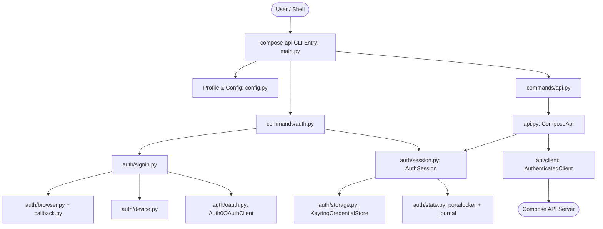

# Compose API Command-Line Interface (`compose_api.cli`)

This package implements `compose-api`, a standalone, native command-line client for the Compose API. It provides secure human authentication through Auth0, credential storage in approved OS credential managers, session lifecycle management with serialized token rotation, and typed interaction with the Compose API via generated client bindings.

---

## Architecture Overview



### Core Design Principles

1. **Lightweight & Isolated Execution:**
   - The CLI does not load FastAPI, SQLAlchemy, HPC services, or server configuration `.env` files.
   - Help (`--help`) and configuration inspection run completely offline without importing heavy dependencies.
2. **Zero Plaintext Credential Exposure:**
   - No passwords or tokens are accepted via command-line arguments or environment variables.
   - No tokens are dumped to `stdout`, `stderr`, or logs.
   - Sessions are persisted exclusively in approved OS-level credential stores (or kept in memory for ephemeral invocations).
3. **Strict Origin & Token Boundary:**
   - Access tokens (targeted to the Compose API audience) are never sent to Auth0 or third-party hosts.
   - ID tokens (targeted to the native client ID) and refresh tokens are never sent to the Compose API.
   - Generated client calls pass through request hooks that enforce exact destination scheme, host, port, and allowed paths.
4. **Crash-Safe Serialized Concurrency:**
   - Cross-process file locking via `portalocker` ensures only one process performs token refresh at a time.
   - An in-flight journal prevents replay of spent refresh tokens if a process crashes mid-refresh.

---

## Directory Structure

```text
compose_api/cli/
├── __init__.py          # Package initialization
├── __main__.py          # Entry point for `python -m compose_api.cli`
├── main.py              # Argparse command tree, exit code mapping, asyncio runner
├── config.py            # CliSettings, TOML loader, origin validation, profile digest
├── errors.py            # Exception hierarchy (CliError) and exit code mapping
├── output.py            # Output sanitization, control-character escaping, JSON formatting
├── api.py               # ComposeApi wrapper around generated client, status classification
├── commands/
│   ├── __init__.py
│   ├── common.py        # Dependency injection / Wiring container for test isolation
│   ├── auth.py          # Handlers for `signup`, `login`, `status`, `logout`
│   └── api.py           # Handlers for `simulators list`, `simulations status/submit`
└── auth/
    ├── __init__.py
    ├── models.py        # Pydantic models (Identity, SessionRecord, AuthTransaction)
    ├── oauth.py         # Auth0OAuthClient: discovery, PKCE, token validation, JWKS
    ├── browser.py       # External system browser launcher
    ├── callback.py      # Loopback HTTP server (127.0.0.1:8400) for PKCE callbacks
    ├── device.py        # RFC 8628 Device Authorization Flow state machine
    ├── signin.py        # Sign-in coordination (browser PKCE vs. device code)
    ├── storage.py       # CredentialStore protocol, KeyringCredentialStore, MemoryCredentialStore
    ├── session.py       # AuthSession: token access, proactive renewal, generation tracking
    ├── state.py         # Process locking, permissions (0700/0600), refresh journal
    └── windows_state.py # Windows ACL and native credential replacement utilities
```

---

## Module Breakdown

### 1. Command Tree & Execution (`main.py`, `output.py`)
- Standard-library `argparse` hierarchy defining `config`, `auth`, `simulators`, and `simulations`.
- Standardized exit codes:
  - `0`: Success.
  - `1`: API error (404, 400/422, 500) or internal bug.
  - `2`: Usage error (invalid arguments, invalid file format).
  - `3`: Authentication required or expired session.
  - `4`: Forbidden (HTTP 403).
  - `5`: Network failure, rate limit (429), or server outage (502/503/504).
  - `6`: Configuration, credential storage, or protocol error.
  - `130`: Interrupted (Ctrl-C).
- `output.py` ensures all terminal output escapes ASCII/ANSI control characters and formats structured JSON errors under `--json`.

### 2. Configuration & Profiles (`config.py`)
- `CliSettings` loads configuration with strict precedence:
  1. Command-line flags (`--profile`).
  2. Environment variables (`COMPOSE_API_CLI_*`).
  3. User configuration file: `config.toml` in the system config directory (`platformdirs.user_config_dir("compose-api")`).
  4. Built-in profile defaults (`production`, `local`).
- Profile bindings calculate a SHA-256 digest over `(issuer, client_id, audience, api_base_url, scopes)`. This isolates stored credentials across environments.

### 3. Authentication & OAuth (`auth/oauth.py`, `auth/models.py`)
- **Transport:** Dedicated `httpx.AsyncClient` with TLS verification, timeouts (5s connect, 15s read), and redirects disabled.
- **Protocol Helpers:** Uses Authlib protocol primitives (`prepare_grant_uri`, `create_s256_code_challenge`, `CodeIDToken`).
- **Validation:**
  - **Access Tokens:** Validated using PyJWT with RS256, strict issuer and audience checks, finite positive expiration, and 60-second leeway.
  - **ID Tokens:** Validated against the client ID audience, correct issuer, and code flow `nonce`.
  - **JWKS Management:** Keys fetched strictly from configured Auth0 tenant discovery endpoints, cached with a 30-second backoff between refetches on unknown key IDs (`kid`).

### 4. Interactive & Headless Flows (`auth/signin.py`, `auth/callback.py`, `auth/device.py`)
- **Browser PKCE (`auth/callback.py`, `auth/browser.py`):**
  - Binds a loopback TCP listener on `127.0.0.1:8400` *before* opening the system browser.
  - Generates cryptographically secure `state`, `verifier`, and `nonce`.
  - Validates exact HTTP Host, path (`/callback`), state, and query length limits (8 KiB).
  - Emits static HTML responses with restrictive CSP (`default-src 'none'`) and `Cache-Control: no-store`.
- **Device Authorization Flow (`auth/device.py`):**
  - RFC 8628 implementation for headless or SSH sessions via `--device`.
  - Displays verification URL and short user code; device code is kept strictly in memory.
  - Handles polling intervals, exponential backoff on `slow_down`, and terminal states (`expired_token`, `access_denied`).
- **Ephemeral Sessions:**
  - Invoked with `--ephemeral-auth` on API commands.
  - Holds tokens exclusively in `MemoryCredentialStore`, omits `offline_access` scope, and discards tokens when the command process exits.

### 5. Credential Persistence & Concurrency (`auth/storage.py`, `auth/session.py`, `auth/state.py`)
- **Store Allowlist:** Only verified OS credential managers are permitted (`KeyringCredentialStore`):
  - macOS Keychain (`keyring.backends.macOS.Keyring`).
  - Linux Secret Service (`keyring.backends.SecretService.Keyring`).
  - Windows Credential Manager (`keyring.backends.Windows.WinVaultKeyring`).
  - Insecure or plaintext fallbacks (e.g., `keyrings.alt`) are explicitly rejected.
- **Atomic Concurrency & Journaling:**
  - State directory files are locked via `portalocker` (30s deadline).
  - POSIX directory permissions are enforced to `0700` and state files to `0600` with file owner validation.
  - Refresh rotation writes an `in_flight` journal entry containing the transaction ID before transmitting the refresh token. If interrupted or crashed, old refresh tokens are never replayed.
  - A generation counter detects concurrent token replacement or logout races.

### 6. API Integration Boundary (`api.py`, `commands/api.py`)
- Wraps generated client operations (`api/client`) inside `ComposeApi`.
- Request hooks guard against credential leakage:
  - Validates destination scheme, host, and port against `api_base_url`.
  - Disallows userinfo, queries, or redirects with credentials.
  - Restricts paths to allowlisted endpoints (`/auth/me`, `/core/simulator/list`, `/results/simulation/status`, `/simulation/run`).
- Automatic retry on 401:
  - Read operations (`simulators list`, `simulations status`) perform at most one proactive token refresh and one replay.
  - Mutation operations (`simulations submit`) **never** replay automatically on 401, timeout, or 5xx to prevent duplicate simulation runs.
- Identity Confirmation:
  - After sign-in, the CLI calls `GET /auth/me` to verify server recognition before reporting success.

---

## Testing & Dependency Injection

The CLI is engineered for complete test isolation without requiring live networks, browser windows, or real OS keyrings during automated runs.

### The `Wiring` Container (`commands/common.py`)
Commands accept an optional `Wiring` object that overrides:
- `auth0_transport`: Injects HTTPX `MockTransport` or ASGI adapters.
- `api_transport`: Injects ASGI `ASGITransport` targeting the FastAPI `app`.
- `browser`: Injects `FakeBrowser` to intercept authorization URLs without launching a browser.
- `store`: Injects `MemoryCredentialStore` to keep tests off the host machine's real keychain.

### Test Suites (`tests/cli/`)

| Test Module | Coverage |
|---|---|
| `test_commands.py` | Parser behavior, help text, subprocess execution, exit codes. |
| `test_config.py` | Profile loading, precedence, TOML parsing, URL validation, binding hashes. |
| `test_oauth.py` | OAuth discovery, PKCE challenge generation, token verification, JWKS rotation and outages. |
| `test_browser_auth.py` | Callback listener HTTP assertions, state mismatch, timeout, browser launch failure. |
| `test_device_auth.py` | Device flow polling, backoff, expired codes, cancellation, ephemeral mode. |
| `test_storage.py` | Keyring backend allowlisting, serialization, corruption handling, locked store detection. |
| `test_session.py` | Concurrent refresh under lock, generation conflict resolution, crash-recovery journaling, logout. |
| `test_os_keyring.py` | Real macOS Keychain / Linux Secret Service opt-in integration tests (`COMPOSE_API_TEST_OS_KEYRING=1`). |
| `test_api.py` | Generated client invocation against real ASGI app, destination guard, 401 retry, multipart upload. |
| `test_errors.py` | Error matrix verification (19 scenarios), redaction, leak scanning for secrets in output/logs. |
| `test_packaging.py` | Built wheel validation, console script declarations, dependency constraints. |
| `test_documentation.py` | Markdown drift tests ensuring `docs/cli.md` documents all commands, options, and exit codes. |

---

## Quick Reference: Developer Commands

```bash
# Run all unit/contract tests for the CLI
uv run pytest tests/cli

# Run real OS Keyring test (writes and cleans up a synthetic record in host Keychain)
COMPOSE_API_TEST_OS_KEYRING=1 uv run pytest tests/cli/test_os_keyring.py

# Run linting, strict mypy type checking, and dependency checks
make check

# Build documentation and check for broken links
make docs-test

# Test local CLI commands
uv run compose-api config show
uv run compose-api auth status
```
